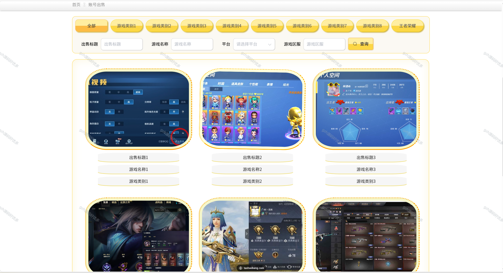
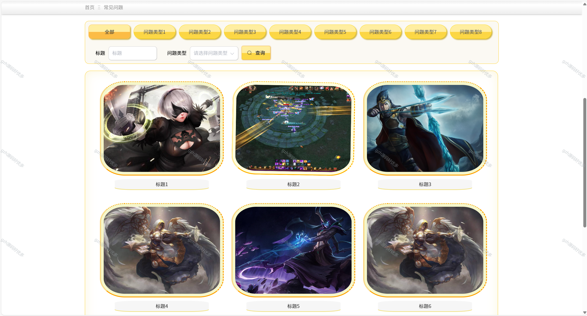
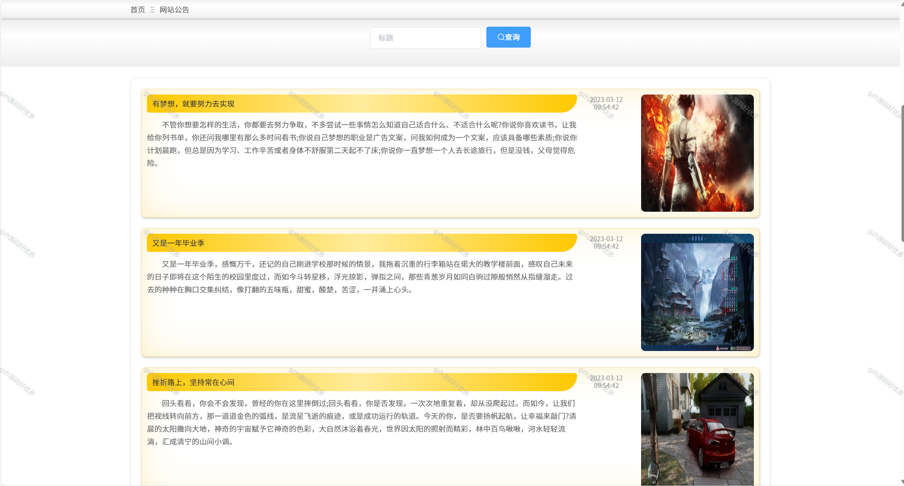
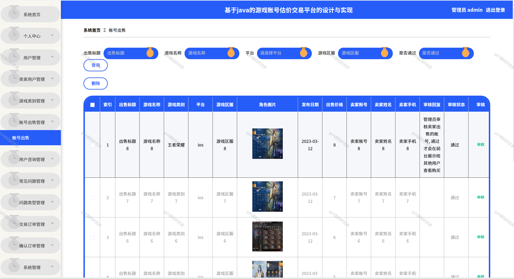
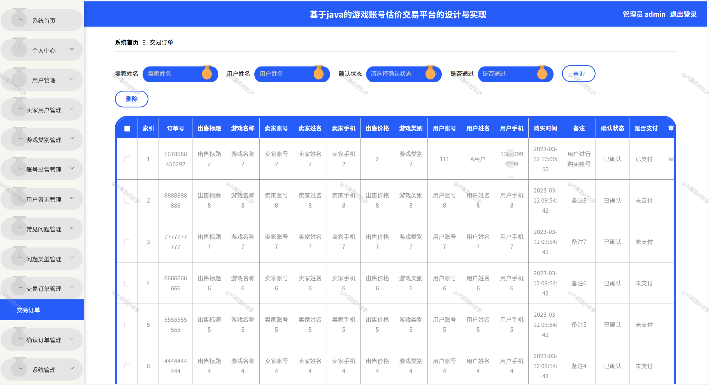
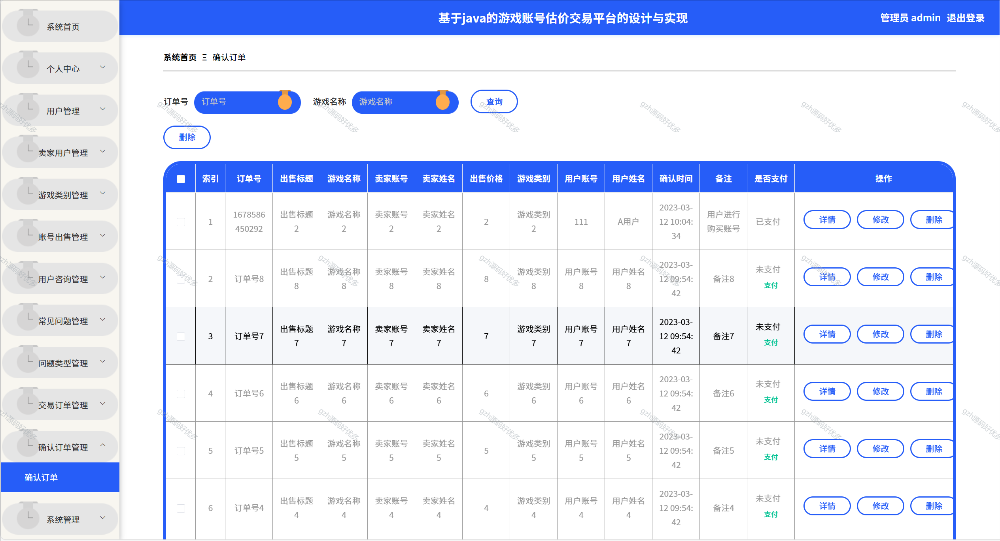
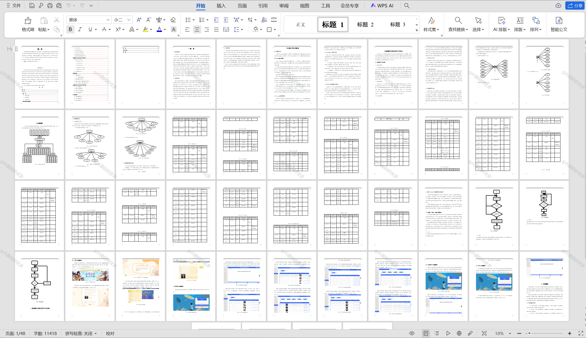

# springbootA295
springbootA295游戏账号估价交易平台
 
## 查看主页获取源码

### 一、关键词
游戏账号买卖估价平台系统，游戏账号交易评估平台系统，游戏账号交易及估值平台

### 二、作品包含
源码+数据库+设计文档万字+PPT+全套环境和工具资源+本地部署教程

### 三、项目技术
前端技术：Html、Css、Js、Vue2.0、Element-ui 
后端技术：Java、SpringBoot2.0、MyBatis

### 四、运行环境（以下版本亲测，其他版本兼容性请自行测试）
开发工具：IDEA/eclipse  + VSCODE

数据库：MySQL5.7（最低要5.7版本）

数据库管理工具：Navicat10以上版本

环境配置软件： JDK1.8 + Maven3.6.3

前端Nodejs：14

浏览器：谷歌浏览器

### 五、项目介绍
项目编号：springbootA295

系统根据现有的管理模块进行开发和扩展，采用面向对象的开发的思想和结构化的开发方法对游戏账号估价交易的现状进行系统调查。采用结构化的分析设计，该方法要求结合一定的图表，在模块化的基础上进行系统的开发工作。在设计中采用“自下而上”的思想，在游戏账号估价交易平台实现了用户信息、账号出售、用户咨询、常见问题、交易订单、确认订单等的功能性。

### 六、运行截图

